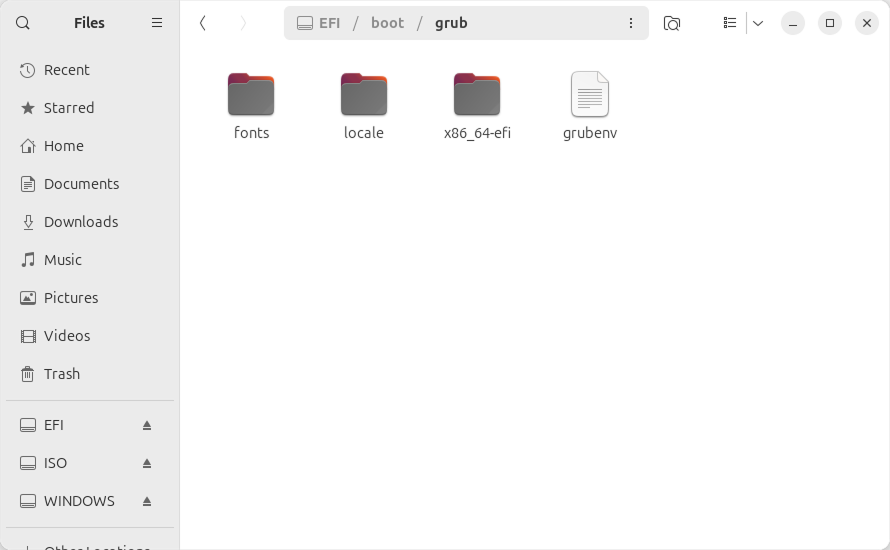
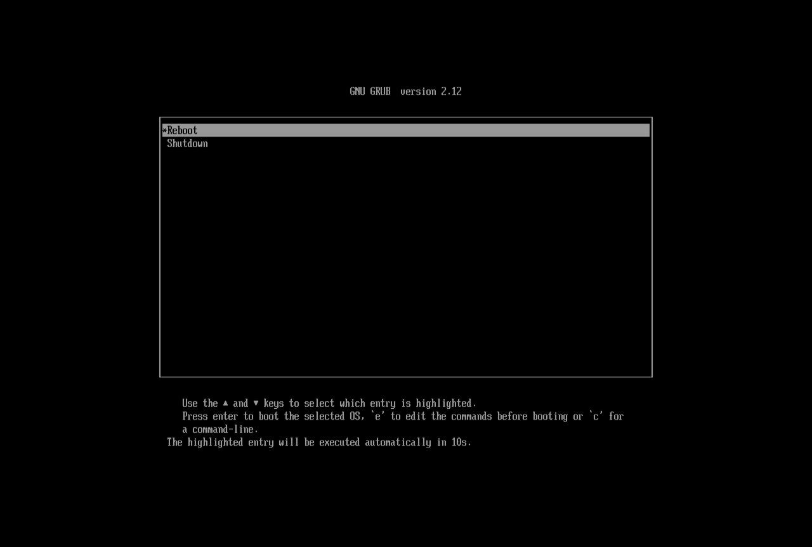

## GRUB2 Installation

This section describes the installation of GRUB2.

### Install GRUB2
The GRUB2 installation process is based on the instructions from [uGrub](https://github.com/adi1090x/uGRUB?tab=readme-ov-file#install-grub2-on-the-usb-flash-drive) and the [ArchWiki](https://wiki.archlinux.org/title/GRUB). An abridged set of instructions for **UEFI x86_64** systems is provided below. If you have a different system type, please refer to the provided sources.

1. Open a terminal and mount the newly created `EFI` partition. 

    In this example, the partition is `/dev/sda1` (as seen in `GParted`), replace this with the appropriate partition for your system. 
    
    **Be aware that device names (such as `/dev/sda1`) may change after a reboot, always check before proceeding.**

    ```
    sudo mount /dev/sda1 /mnt
    ```

2. Install GRUB2. Again, replace `/dev/sda1` with the appropriate partition for your system.

    ```
    sudo grub-install --force --removable --target=x86_64-efi --boot-directory=/mnt/boot --efi-directory=/mnt /dev/sda1
    ```

3. If successful, the following message will appear.

    ```
    Installing for x86_64-efi platform.
    Installation finished. No error reported.
    ```

4. Unmount the partition.

    ```
    sudo umount /mnt
    ```

### Configure GRUB2
1. Open the `EFI` partition in a file manager or terminal. Navigate to `boot/grub` or `boot/grub2`, whichever is present.

    <p align="center">
        
    </p>

2. Create a new file `grub.cfg` (if in a file manager, right click, **Open in Terminal**, enter the command `touch grub.cfg`).
3. Open `grub.cfg` in a file editor and add the following.

    ```
    set timeout=10
    set default=0

    menuentry "Reboot" {
        reboot
    }

    menuentry "Shutdown" {
        halt
    }
    ```
    
### Test GRUB2
1. Reboot your device and boot from the USB. If successful, the following will appear.

    <p align="center">
        
    </p>

---
<table width="100%">
<td align="left"><a href="partition-setup.md">⟸ Partition Setup</a></td>
<td align="right"><a href="windows-installer.md">Windows Installer ⟹</a></td>
</table>