## Partition Setup

This section describes the USB partition layout, consisting of three partitions: GRUB2, Windows installer, and Linux ISOs.

### Start GParted
1. Insert the USB drive into your Linux machine.
2. Launch **GParted**.
3. From the dropdown menu in the top-right corner, select the USB drive.

    **Ensure that the correct drive has been selected before making any changes! All data on the drive will be lost.**

    In this example, `/dev/sda` (28.91 GiB) is my USB drive. The name of your USB _will_ vary, make sure to select the correct one; you can usually identify it based on the drive size. 
    
    `/dev/nvme0n1` (238.47 GiB) is my SSD.

    

        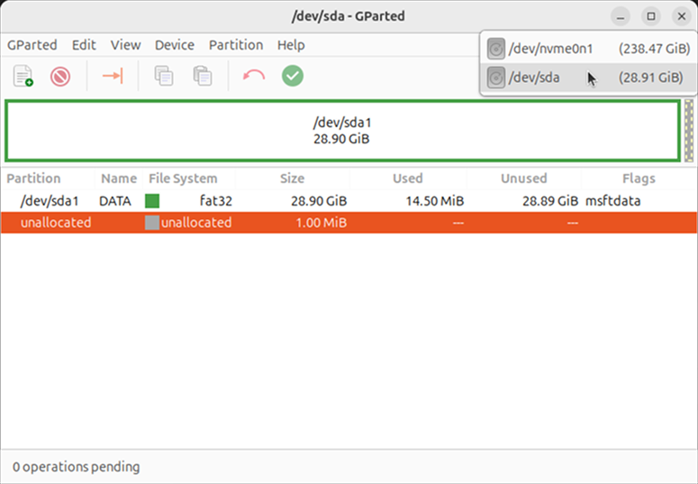
    

### Unmount All Existing Partitions
All partitions must be unmounted before we can create a new partition table.
1. Select an existing partition.

    

        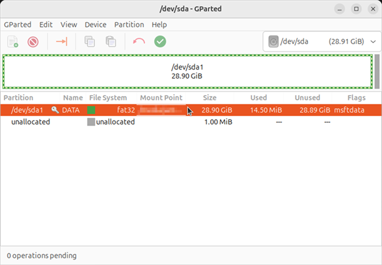
    

2. From the menubar, select **Partition** > **Unmount**. If it is already unmounted, leave it as is.

    

        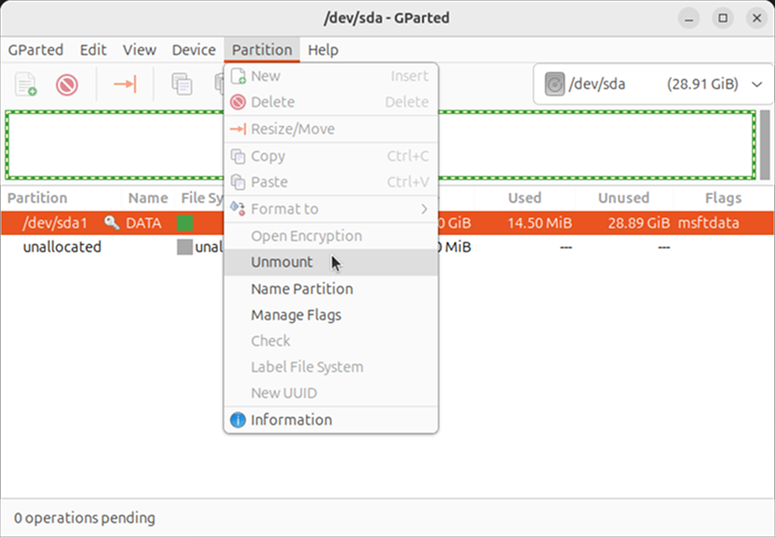
    

3. Repeat steps 1-2 until all partitions are unmounted.

### Create a New Partition Table

**Once again, ensure that the correct drive has been selected before proceeding! All data on the drive will be lost.**

1. Select **Device > Create Partition Table**.

    

        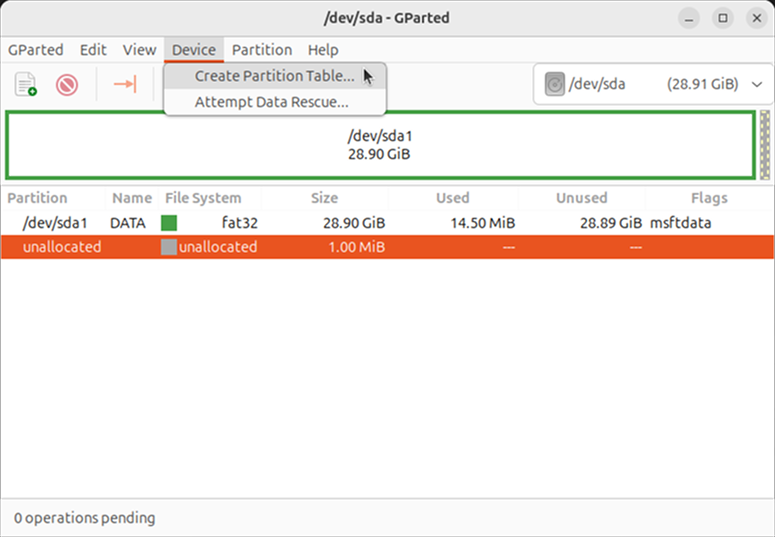
    

2. Set the new partition table type to `gpt` and click **Apply**.

    

        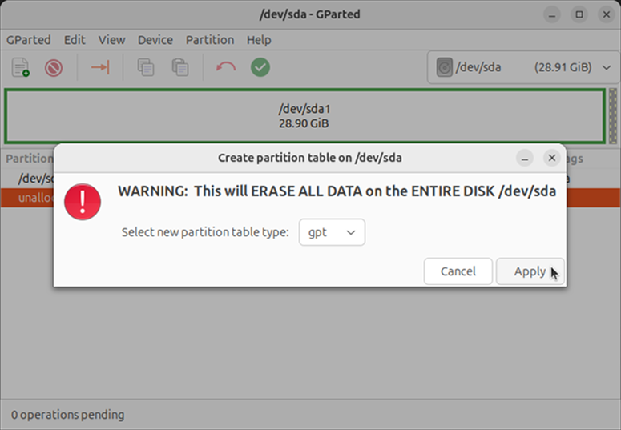
    

### Create the EFI Partition
GRUB2 will be installed in this partition.
1. Select the unallocated space, then select **Partition > New**.

    

        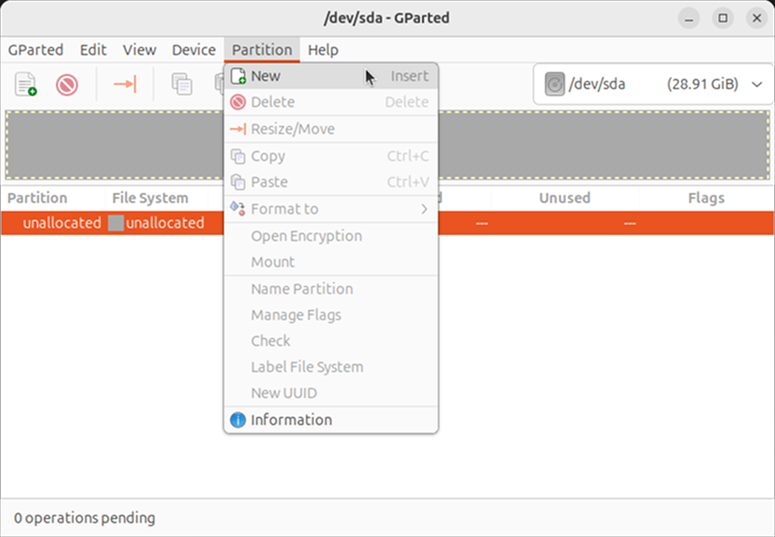
    

    
2. Set the size to `550 MiB`, create as `Primary Partition`, and set the file system to `fat32`. The label and partition name are arbitrary; in this example, I will use `EFI` for both. Click **Add**.

    

        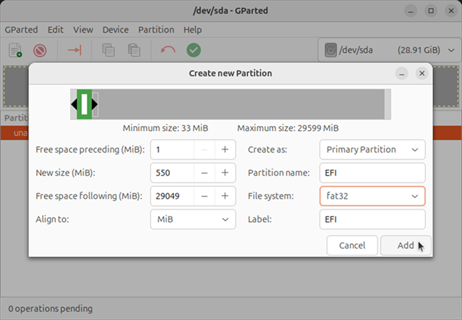
    

### Create the WINDOWS Partition
The extracted contents of the Windows ISO will be placed in this partition. The size of `Win11_25H2_English_x64.iso` is 7.7 GB (at the time of writing). To be safe, we will set the partition size a little larger at 8.0 GB (7629 MiB).

Note that if you have multiple Windows ISOs, you will need to create separate partitions for each.
1. Select the unallocated space, then select **Partition > New**.
2. Set the size to `7629 MiB`, create as `Primary Partition`, and set the file system to `fat32`. Again, the label and partition name are arbitrary; in this example, I will use `WINDOWS` for both. Click **Add**.

    

        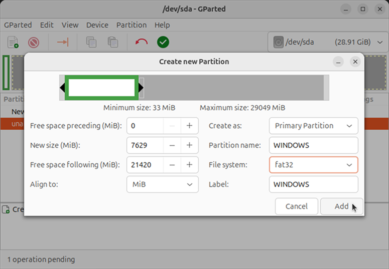
    

### Create the (Linux) ISO Partition
Linux ISO files will be placed in this partition. The size of this partition may span the remaining available space.

Unlike Windows, Linux ISOs can usually be booted directly from the ISO file using GRUB2 loopback (without extraction). As such, we can easily store multiple ISO files within the same partition.
1. Select the unallocated space, then select **Partition > New**.
2. Leave the size as default (or set to a desired size), create as `Primary Partition`, and set the file system to `ext4`. I will use `ISO` for the label and partition name. Click **Add**.

    

        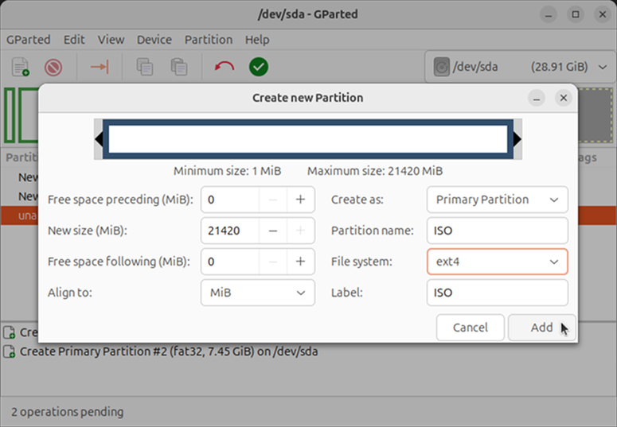
    

### Apply All Operations
1. From the toolbar, select ✅ to apply all operations.

    

        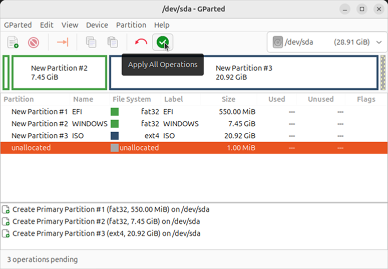
    

### Verify Partition Flags
- By default, the `msftdata` flag will be set for the FAT32 partitions, leave this as is. 
- By default, the `ext4` partition will not have any flags set, leave this as is.
- Do _not_ set the `boot` or `esp` flags for any of the partitions. If you have already done so, reset to the default flags by selecting **Partition > Manage Flags** and checking/unchecking the corresponding boxes. 
    
    

        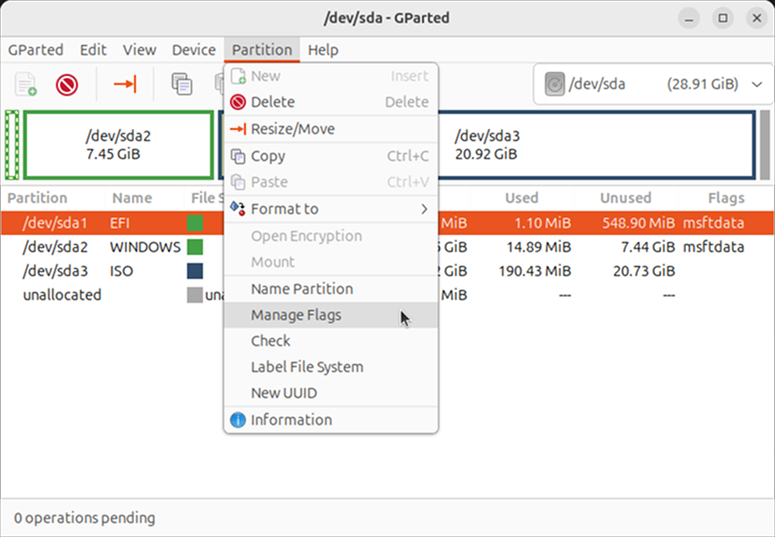
    

> **Additional Notes**
> - In **GParted**, setting the `esp` flag will change the partition GUID code to `C12A7328-F81F-11D2-BA4B-00A0C93EC93B`, marking it as an EFI System Partition (ESP).
> - From my limited testing, it appears that the Windows installer identifies ESPs based on the GUID code and will put the bootloader into whatever ESP it can find. 
> - If the Windows installer detects an ESP on the USB, it may install the bootloader there, resulting in a system that will not boot unless the USB is plugged in.
> - Even if the `esp` flag is not set, most [UEFI firmware will still look for a FAT partition containing the appropriate content](https://uefi.org/specs/UEFI/2.11/13_Protocols_Media_Access.html#number-and-location-of-system-partitions) (for example, `EFI/BOOT/BOOTX64.EFI`) and boot from it. However, this behaviour is firmware-dependent and **not guaranteed** by the UEFI specification. **This setup may fail on some systems.** 

---
<table width="100%">
<td align="left"><a href="prerequisites.md">⟸ Prerequisites</a></td>
<td align="right"><a href="grub2-installation.md">GRUB2 Installation ⟹</a></td>
</table>