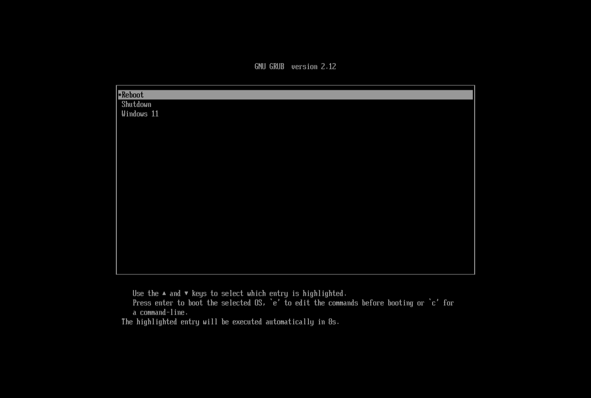
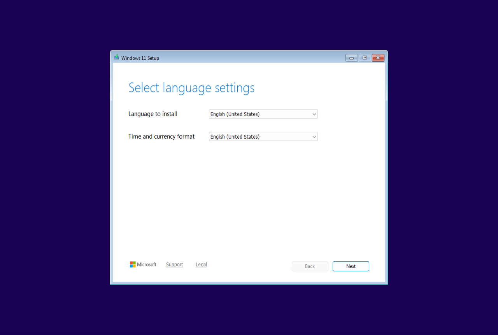

## Windows Installer

This section describes how to prepare a Windows installer so it can be booted by GRUB2.
> **Additional Notes**
>   - This example uses `Win11_25H2_English_x64.iso`.
>   - Windows ISOs cannot be chainloaded directly with GRUB2. Instead, the contents of the ISO must be extracted and GRUB2 must chainload the Windows EFI binary.
>   - The FAT32 file system has a maximum file size of 4 GB. Since `install.wim` (a file in the Windows ISO) usually exceeds this limit, it must be split into multiple `.swm` files. 

### Mount the ISO File and the USB Partition
1. Open a terminal and navigate to the directory containing the Windows ISO file.
2. Create a mount point and mount the ISO file. Replace `Win11_25H2_English_x64.iso` with the appropriate filename for your setup. 

    ```
    sudo mkdir -p /mnt/win-iso
    sudo mount Win11_25H2_English_x64.iso /mnt/win-iso
    ```

3. Create a mount point and mount the `WINDOWS` partition on the USB. 

    In this example, the partition is `/dev/sda2` (as seen in `GParted`). Replace this with the appropriate partition for your system. 

    ```
    sudo mkdir -p /mnt/win-usb
    sudo mount /dev/sda2 /mnt/win-usb
    ```

### Extract Windows Installer Files
1. Copy all files from the ISO _except_ `install.wim`.

    ```
    rsync -av --exclude=sources/install.wim /mnt/win-iso/ /mnt/win-usb/
    ```

    > **Additional Notes**
    > 
    > Do not forget the trailing slashes on the file paths! Without them, `rsync` will copy the source directory rather than its contents.

2. Split `install.wim` into `.swm` files and copy them to the USB.

    ```
    wimlib-imagex split /mnt/win-iso/sources/install.wim /mnt/win-usb/sources/install.swm 3800
    ```

    This creates multiple `.swm` files with a maximum file size of 3800 MB (below the FAT32 limit). These will be named `install.swm`, `install2.swm`, `install3.swm`, etc.

### Rename Windows EFI Binary
1. Rename the Windows EFI binary. The name can be arbitrary, as long as it is not `bootx64.efi`. In this example, I will name it `bootx64-windows.efi`.

    ```
    cd /mnt/win-usb/efi/boot
    mv bootx64.efi bootx64-windows.efi
    ```

    > **Additional Notes**
    > 
    > Without renaming the binary, both the `EFI` and the `WINDOWS` partitions would contain `/efi/boot/bootx64.efi`. This is the fallback boot filename for removable media on a **UEFI x64** system. When booting from a USB device, firmware may automatically load this file. If multiple partitions provide this fallback path, there is no guarantee on which one will be selected by the firmware. 
    >
    > To ensure that the firmware boots GRUB2 first, rename the `WINDOWS` EFI binary so it no longer uses the [canonical fallback name](https://uefi.org/specs/UEFI/2.11/03_Boot_Manager.html#removable-media-boot-behavior).

### Unmount the ISO File and the USB Partition
1. Unmount both the ISO file and the `WINDOWS` partition.

    ```
    cd ~
    sudo umount /mnt/win-iso
    sudo umount /mnt/win-usb
    ```

### Update GRUB2 Configuration
1. Identify the UUID of the `WINDOWS` partition.

    ```
    sudo blkid
    ```

    You should see output similar to:

    ```
    ...
    /dev/sda2: LABEL_FATBOOT="WINDOWS" LABEL="WINDOWS" UUID="3D0B-03DF" BLOCK_SIZE="512" TYPE="vfat" PARTLABEL="WINDOWS" PARTUUID="0bef5a9c-7b65-4b5b-9ffa-949edd1a7290"
    ...
    ```
    
    Find the line corresponding to your `WINDOWS` partition and take note of the UUID. In this example, it is `3D0B-03DF`.
2. Replace the content of `grub.cfg` with the following configuration (substitute your UUID as needed).

    ```
    set timeout=10
    set default=0

    menuentry "Reboot" {
        reboot
    }

    menuentry "Shutdown" {
        halt
    }

    menuentry "Windows 11" {
        insmod part_gpt
        insmod fat
        search --no-floppy --fs-uuid --set=root 3D0B-03DF
        chainloader /efi/boot/bootx64-windows.efi
        boot 
    }
    ```

### Test GRUB2 + Windows
1. Reboot your device and boot from the USB. The following should appear.

    <p align="center">
        
    </p>

2. Select **Windows 11** from the menu. The screen should turn black with a visible cursor.

    <p align="center">
        
    </p>

3. After a delay, the Windows loading indicator should appear.

    <p align="center">
        
    </p>
    
4. Once loading completes, the Windows installer will start.

    <p align="center">
        
    </p>

---
<table width="100%">
<td align="left"><a href="grub2-installation.md">⟸ GRUB2 Installation</a></td>
<td align="right"><a href="linux-iso-files.md">Linux ISO Files ⟹</a></td>
</table>